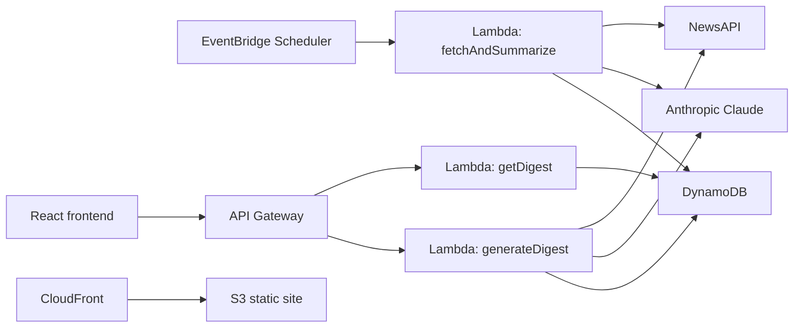

# Daily News Intelligence

Daily News Intelligence is an AWS-backed portfolio project that builds a curated daily news digest for a selected date, summarizes each topic with an LLM, stores the results in DynamoDB, and serves them through a React frontend.

The point of this repo is not only to show AI integration. It is meant to show end-to-end software engineering judgment:

- infrastructure as code with AWS CDK
- scheduled and on-demand backend workflows with Lambda
- secret management with AWS Secrets Manager
- persistent storage in DynamoDB
- API design with API Gateway
- static frontend hosting with S3 + CloudFront
- CI validation and deployment workflows with GitHub Actions

## Product Behavior

- Every supported date can have a stored set of three curated trending topics.
- Dates from `2026-04-01` onward can be generated on demand if they do not already exist.
- Users can add their own custom topic for any supported date.
- Every digest item stores source links, summary text, article counts, and whether the topic was trending or user-added.
- Trending generation is explicit in the UI. Loading a date does not automatically write new records.

## Architecture



More design notes live in `docs/architecture.md`.

## Repository Layout

- `frontend`: React + Vite application
- `backend/lambdas`: Lambda handlers and digest generation logic
- `infrastructure`: AWS CDK stack for API, compute, storage, scheduler, and hosting
- `docs`: architecture and operations notes for demo and maintenance

## Current Capabilities

- scheduled daily generation of curated trending digests
- manual generation of curated trending digests for historical dates
- custom topic generation and persistence
- date-based browsing in the UI
- CloudFront-hosted static frontend support
- CloudWatch alarms and scheduler dead-letter queue
- backend and frontend tests
- GitHub Actions CI and deployment workflows

## Known Limitations

- Topic discovery is based on a curated broad-news query plus heuristic or LLM labeling. It is not a global ranking of everything that trended on the internet that day.
- The supported date range starts at `2026-04-01` because this project is optimized for a bounded portfolio dataset and demo cost control rather than open-ended archival coverage.
- Upstream quality depends on NewsAPI coverage and the LLM summary step, so the digest is best treated as a fast briefing view rather than a canonical news source.

## Local Commands

From the repository root:

```bash
npm ci
npm run lint
npm run test:backend
npm run test:frontend
npm run build:frontend
npm run build:backend
npm run build:infrastructure
```

## Local Environment

Frontend:

- `frontend/.env.local`
- `VITE_API_BASE_URL=<api gateway base url>`

Infrastructure deployment requires:

- `NEWS_API_SECRET_ARN`
- `CLAUDE_API_SECRET_ARN`

Example:

```bash
cd infrastructure
npx cdk deploy -c newsApiSecretArn=arn:aws:secretsmanager:... -c claudeApiSecretArn=arn:aws:secretsmanager:...
```

Build the frontend before deploying the stack so the S3 deployment uploads the latest `frontend/dist` bundle.

## GitHub Actions

The repo includes:

- `.github/workflows/ci.yml` for lint, test, and build validation
- `.github/workflows/deploy.yml` for production deployment with AWS OIDC

The deploy workflow expects these GitHub secrets:

- `AWS_DEPLOY_ROLE_ARN`
- `NEWS_API_SECRET_ARN`
- `CLAUDE_API_SECRET_ARN`
- `VITE_API_BASE_URL`

## Demo Story

This is the short version to show a reviewer:

1. Open the CloudFront URL.
2. Pick a historical date after `2026-04-01`.
3. Generate and persist the three curated trending topics for that day.
4. Add a custom topic and show that it is stored alongside the trending topics.
5. Point to the CDK stack, CI workflow, and operations notes to show this is more than a UI demo.

## Why It Matters

This project is meant to show end-to-end engineering ownership rather than just a UI or prompt demo. It covers architecture, deployment, cloud services, persistence, observability, operational safety, and AI-assisted product behavior in one coherent repo.
