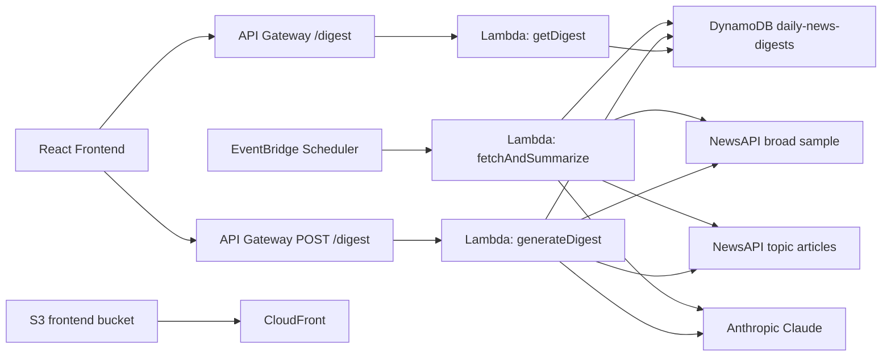

# Architecture Notes

## Why This Design

- `React + Vite` keeps the frontend small and fast while still giving a typed UI layer.
- `API Gateway + Lambda` is a good fit because digest generation is bursty and user-driven rather than steady high-throughput traffic.
- `DynamoDB` works well because the dominant read pattern is `date -> all topics for that date`.
- `Secrets Manager` keeps API credentials out of the repo and out of Lambda code.
- `CloudFront + S3` gives a clean public link for the frontend without running a server.

## Digest Flow

## Topic Discovery Strategy

- For each requested date, the backend fetches a curated broad English-language news sample for that day.
- Claude extracts three short topic labels from that sample, with a heuristic fallback when the model call fails.
- The backend then runs a second pass per topic to fetch relevant articles and store a final digest record.
- Users can also submit a custom topic for any supported date, which is stored alongside the trending topics.

## Tradeoffs

- Topic discovery is intentionally heuristic. It favors a practical, explainable pipeline over a heavyweight trend-classification system, but it should be understood as curated topic discovery rather than a universal trend detector.
- The table uses `date` and `topic` as keys because the product is organized around browsing one day at a time.
- The supported date range starts at `2026-04-01` to keep the portfolio dataset bounded and demo costs predictable.
- The frontend does not auto-generate data on page load; writes are explicit so the UI keeps read and generation actions separate.
